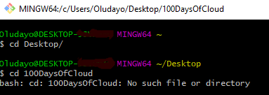
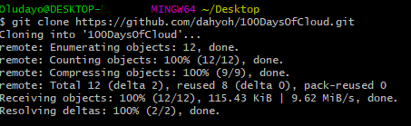

<!-- This is a template you can use for quick progress days. It removes a lot of the steps we encourage you to share in the longer template 000-DAY-ARTICLE-LONG-TEMPLATE.MD-->

# Day2 100DaysOfCloud - 

## Cloud Research

- Today I was able to figure out and set-up my Github repo after battling with this for a couple of days. I had started CCP video on youtube by Andrew Brown at Exam Pro. 

## Have difficulty setting up your github repo [On Windows PC].

This is how I setup my git.

### Step 1 — Open your Github account on the website www.github.com
### Step 2 — Go to https://git-scm.com/download/win
### Step 3 — Identify the bit in which your PC operating system is running (i.e 32 or 64 bit)
### Step 4 — Download the specific installation set up for your PC bit - under [Git for Windows Setup] 
### Step 5 — Install
### Step 6 — Fire Up "Git Bash"

### ****These are the commands you need to run in the git bash****

### Command 1 — Summary of Step

### Command 2 — Summary of Step

## Resources — Both resources are FREE

### First  — Youtube playlist by Andrew Brown of Exam Pro
[Youtube](https://www.youtube.com/watch?v=B4kl23udOKo&list=PLBfufR7vyJJ4fOplWPOtYqRyQ6YPMsBsF&t=0s)

### Second  — Amazon Cloud Service
[Amazon](https://www.aws.training/Details/eLearning?id=60697)

## Social Proof

[Twitter](https://twitter.com/dahyooh/status/1362924593707708425)

[LinkedIn](https://www.linkedin.com/feed/update/urn:li:activity:6768003652054470656)

