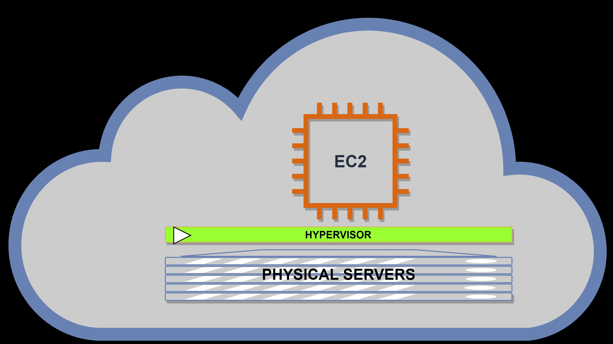

**Add a cover photo like:**

# Amazon Elastic Compute Cloud - [EC2]

## Introduction

✍️ (Why EC2?) For starters in AWS Cloud, you need to understand the concept of Amazon EC2.

## Prerequisite

✍️ (What is EC2?) AWS servers are virtual and the services used to access Amazon servers is called EC2. In a simple explanation to use AWS request for EC2 instance and use it, terminate when you are done.

[NOTE: INSTANCE is also known as SERVERS, in this case is a VIRTUAL SERVERS]

See below for more details on EC2.

## Use Case

- 🖼️ (EC2) When an EC2 instances are spin-up, you are taking up you are taking a part of a HOST with a multiple of other instances. This is known as Virtual Machines.

HYPERVISOR runnning on the HOST machine is responsible underlying physical resources.

- ✍️ (Idea of Sharing) This sharing idean is know as "MULTI-TENANCY"

## EC2 offers Cloud Research

- ✍️  flexibility
- ✍️  Cost Effective
- ✍️  Quick
- ✍️  Control

## Vertical Scaling

Since EC2 instances are resizable

✍️ Start with small instances, when the capacity max-out, you can give MEMORY and CPU -- this is known as VERTICAL SCALING

## Types of EC2 Instances

Amazon EC2 instance are grouped under an instance family and optimized for certain task. They offer varying conbinations of CPU, Memory, Storage and Network capacity.

- ✍️  General purpose
- ✍️  Compute optimized
- ✍️  Memory optimized
- ✍️  Accelerated computing
- ✍️  Storage optimized

### Step 1 — Summary of Step

### Step 1 — Summary of Step

### Step 3 — Summary of Step

## ☁️ Cloud Outcome

✍️ (Result) Describe your personal outcome, and lessons learned.

## Next Steps

✍️ Describe what you think you think you want to do next.

## Social Proof

✍️ Show that you shared your process on Twitter or LinkedIn

[link](link)
